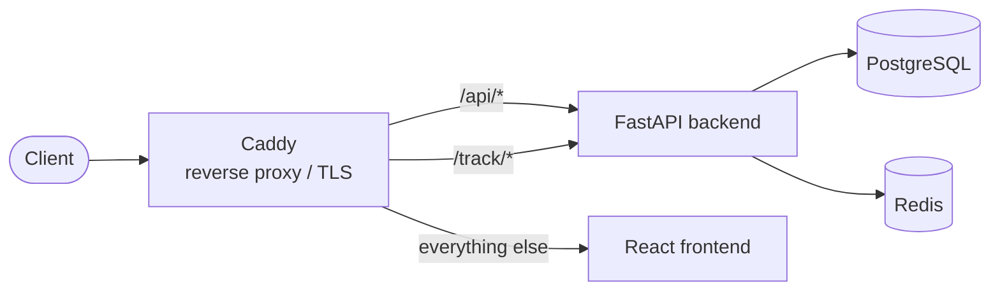

## Stack

- **Backend:** FastAPI (Python), SQLAlchemy, Alembic migrations
- **Frontend:** React + Vite + TypeScript, Tailwind CSS (design-token system, light/dark)
- **Database:** PostgreSQL
- **Cache/queue:** Redis
- **Reverse proxy / TLS:** Caddy
- **Operation:** Docker Compose (rootless, hardened)

## Routing (Caddy)

- `/api/*` → backend (prefix is stripped)
- `/track/*` → backend (public tracking endpoints: pixel, click, landing, submit)
- everything else → frontend

## Key concepts

- **Singleton configs** in the DB: LDAP, OIDC, SMTP, security policy — created on first access.
- **Tracking token** per recipient: unguessable, embedded in links and the pixel.
- **Two-step login** when 2FA is active: password → 2FA code; in between a short-lived, scoped pre-auth token that grants no regular API access.

## Security

- **Passwords:** Argon2id (OWASP recommendation).
- **Runtime secrets** (SMTP/LDAP/OIDC credentials, TOTP secret): encrypted at rest via **Fernet**, key derived from `SECRET_KEY`. Never returned in plain text via the API.
- **Operator secrets** (`SECRET_KEY`, DB password): exclusively via `.env`.
- **Backup codes:** stored only as a hash.

## Data (excerpt)

- `users`, `templates` (incl. attachments, optional Markdown source), `groups` / `group_members`, `sending_profiles`, `landing_pages`, `campaigns`, `recipients`, `tracking_events`, `audit_events`, `security_config`.

See also: [Installation](/en/guides/installation/)
