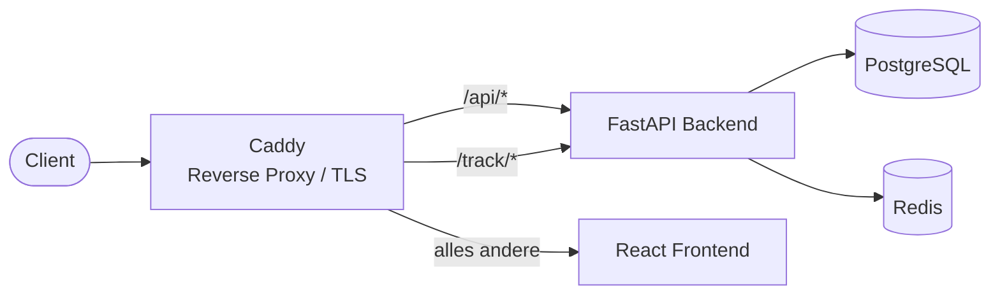

## Stack

- **Backend:** FastAPI (Python), SQLAlchemy, Alembic-Migrationen
- **Frontend:** React + Vite + TypeScript, Tailwind CSS (Design-Token-System, Light/Dark)
- **Datenbank:** PostgreSQL
- **Cache/Queue:** Redis
- **Reverse Proxy / TLS:** Caddy
- **Betrieb:** Docker Compose (rootless, gehärtet)

## Routing (Caddy)

- `/api/*` → Backend (Prefix wird entfernt)
- `/track/*` → Backend (öffentliche Tracking-Endpunkte: Pixel, Klick, Landing, Submit)
- alles andere → Frontend

## Wichtige Konzepte

- **Singleton-Configs** in der DB: LDAP, OIDC, SMTP, Sicherheits-Policy — beim ersten Zugriff angelegt.
- **Tracking-Token** pro Empfänger: unratebar, in Links und Pixel eingebettet.
- **Zweistufiger Login** bei aktivem 2FA: Passwort → 2FA-Code; dazwischen ein kurzlebiger, gescopeter Pre-Auth-Token, der keinen regulären API-Zugriff erlaubt.

## Sicherheit

- **Passwörter:** Argon2id (OWASP-Empfehlung).
- **Laufzeit-Secrets** (SMTP-/LDAP-/OIDC-Zugangsdaten, TOTP-Secret): verschlüsselt at-rest via **Fernet**, Schlüssel abgeleitet aus `SECRET_KEY`. Über die API nie im Klartext zurückgegeben.
- **Betreiber-Secrets** (`SECRET_KEY`, DB-Passwort): ausschließlich über `.env`.
- **Backup-Codes:** nur als Hash gespeichert.

## Daten (Auszug)

- `users`, `templates` (inkl. Anhänge, optionale Markdown-Quelle), `groups` / `group_members`, `sending_profiles`, `landing_pages`, `campaigns`, `recipients`, `tracking_events`, `audit_events`, `security_config`.

Siehe auch: [Installation](/guides/installation/)
